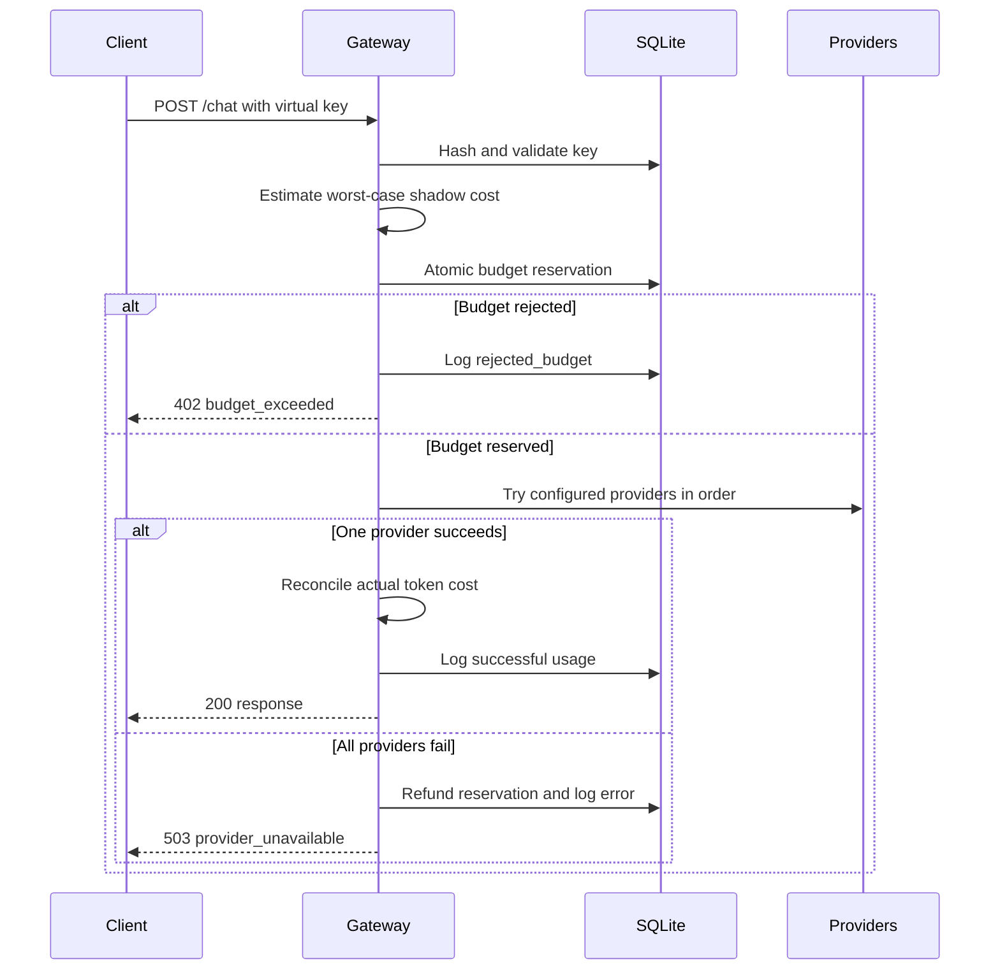

# DECISIONS

## What I Built

This is a Node/Express LLM gateway for Groq, Gemini, and OpenRouter. Clients use gateway-issued virtual keys, while provider credentials stay on the server. Requests go through an ordered provider cascade at `/chat`, with per-key budget enforcement and SQLite usage logging.

The gateway does not fabricate a response when every provider fails. It returns a generic retryable `503` and keeps upstream error details in server logs only.

## Request Lifecycle

## Top Decisions

**1. Reserve, then reconcile budgets.** Before any network call, the gateway atomically reserves the maximum shadow cost for the models that can be tried. After success, it replaces that reservation with the actual token-based cost. After total failure, it refunds the reservation. This prevents fallback providers from bypassing a key's budget and prevents failed requests from consuming spend.

**2. Internal shadow pricing for free tiers.** Provider free tiers have no invoice cost, but the gateway still needs meaningful per-key accounting. Each model has an internal USD-per-token rate. Actual provider-reported cost is respected when it exceeds the shadow cost; a reported zero never makes a successful request free internally.

**3. Synchronous SQLite.** Node's built-in `node:sqlite` avoids native compilation and makes the conditional budget update atomic within one process. This requires Node `>=22.5.0` and does not provide multi-process coordination.

**4. Sequential provider cascade.** Groq, Gemini, and OpenRouter are tried in `PROVIDER_ORDER`. Any failure moves to the next provider. If the chain is exhausted, the client receives a generic retryable error rather than an internal model error or canned answer.

**5. Small OpenAI-shaped contract.** The gateway accepts `messages`, optional `model`, `max_tokens`, and `tier`, then returns normalized choices and usage. Gemini's native request and response format is translated in its adapter.

## Budget Enforcement

Per-key enforcement is required and happens before provider calls. The SQL condition `spent_usd + reservation <= budget_usd` rejects a request with `402` before it reaches the network. A default request is priced against the most expensive reachable model, not a zero-cost placeholder. This is deliberately conservative: a request near its limit may be rejected before the gateway knows which provider will succeed, but it cannot overspend the key under the single-process model.

## Known Limits

1. SQLite coordination is not sufficient for multiple gateway processes.
2. Token estimation before a call uses `characters / 4`; provider tokenizers would be more accurate.
3. Provider catalogs and free-tier availability change, so model defaults must be checked periodically.
4. `/admin/keys` is intentionally unauthenticated for this local project and must be protected before public deployment.
5. There is no streaming or idempotency support yet.
